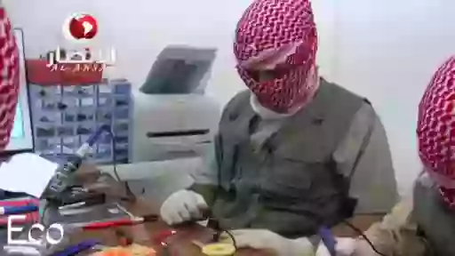

<!-- markdownlint-disable first-line-h1 -->
<!-- markdownlint-capture -->
<!-- markdownlint-disable no-inline-html -->
<div align="center">

  

  <!-- markdownlint-disable-next-line heading-start-left -->
  # Redmi 10C debloated MIUI \[WIP\]

  [][sponsor_link]

  > 🩹 Patches for creating a clean MIUI by yourself

</div>
<!-- markdownlint-restore -->

## ✨ Features

- Removed `cust.img` which reduces firmware size by 1.2+ GB and speeds up installation speed by a couple of minutes
- Removed unnecessary preinstalled APKs and removed default audio recording permissions for some apps
- Clean factory firmware that you can edit and control

## 🛠️ Getting started

> [!WARNING]
> **Disclaimer**: These patches are under development and have not yet been sufficiently tested, all risks associated with modifying system files are your own responsibility.

### Prerequisites

- **OS**: **Linux** (or [**WSL**](https://learn.microsoft.com/windows/wsl/about)) for modifying files and applying patches, the following instructions are written only for Linux, for flashing firmware you can also use Windows
- [git](https://git-scm.com/downloads)
- [uv] to run Python
- 💿 Redmi 10C ROM (fastboot), I recommend using the **European** version of MIUI - <https://xmfirmwareupdater.com/miui/fog/stable/V14.0.10.0.TGEEUXM>

  These instructions use the `fog_eea_global_images_V14.0.10.0.TGEEUXM_20250224.0000.00_13.0_eea_f07e576e57.tgz` image, you can use a different image, but then the patches may not apply

## 📦 Unpacking the Archive

1. Copy the ROM archive to a convenient directory.
2. Verify the archive checksum to verify its integrity:

   ```bash
   md5sum fog_eea_global_images_V14.0.10.0.TGEEUXM_20250224.0000.00_13.0_eea_f07e576e57.tgz
   ```

   The result should match this checksum:

   ```plaintext
   f07e576e5745f36310a2463038662b59
   ```

   If you use a different image, the checksum must match the one listed on the website from which you downloaded it.

3. Extract the archive:

   ```bash
   tar -xf fog_eea_global_images_V14.0.10.0.TGEEUXM_20250224.0000.00_13.0_eea_f07e576e57.tgz
   ```

## 🩹 Applying the Patches

1. Copy the patch folder from this repository to the folder with the extracted ROM
2. Apply all basic patches:

   ```bash
   for patch in patches/*.patch; do git apply "$patch"; done
   ```

   To find out what these patches do, you can read the patch files, they describe in human language what has been changed.

### 🥼 Advanced patches

#### **`images/userdata.img`**

First, you need to unpack this file

To do this, you will need to install the `simg2img` tool:

```bash
sudo apt install android-sdk-libsparse-utils -y
```

Then run the command:

```bash
simg2img images/userdata.img images/userdata.raw.img
```

Then we need to mount the `images/userdata.raw.img` file:

```bash
mkdir images/userdata
sudo mount -t f2fs -o loop,rw images/userdata.raw.img images/userdata
```

Now we can apply the patches to the `images/userdata` folder:

```bash
for patch in patches/04-userdata.img/*.patch; do git apply "$patch"; done
```

Now we need to package the image back:

```bash
sudo umount images/userdata
rm images/userdata.img
img2simg images/userdata.raw.img images/userdata.img
rm images/userdata.raw.img
rm -rf images/userdata
```

Great! `images/userdata.img` is now patched

---

#### **`images/super.img`**

> [!WARNING]
> This section is a WIP and is not yet complete and may change.

To work on this partition we need to download `lpunpack` to unpack `super.img` and `lpmake` to pack it:

```bash
wget https://raw.githubusercontent.com/Exynos-nibba/lpunpack-lpmake-mirror/d0f9da322b764871e54072d1b3e9d67c09cd715c/binary/{lpunpack,lpmake}
chmod +x ./{lpunpack,lpmake}
```

Then we need to unpack all the partitions from `super.img` into the `images/super` folder:

```bash
simg2img images/super.img images/super.unsparse.img
mkdir images/super
./lpunpack images/super.unsparse.img images/super
```

##### **`mi_ext_a.img`**

Allocate a free space for changes:

```bash
fallocate images/super/mi_ext_a.img -l 50M
e2fsck -yf images/super/mi_ext_a.img
resize2fs images/super/mi_ext_a.img 50M
```

<!-- markdownlint-disable-next-line no-inline-html -->


We need to disable the `shared_blocks` option, otherwise we won't be able to mount the image (see [https://blog.senyuuri.info/posts/2022-04-27-patching-android-super-images](https://blog.senyuuri.info/posts/2022-04-27-patching-android-super-images/#:~:text=It%20turned%20out%20that%20system%20imgage%20in%20Android%2010%2B%20is%20formated%20with%20EXT4_FEATURE_RO_COMPAT_SHARED_BLOCKS%2C%20found%20by%20%40topjohnwu) and <https://x.com/topjohnwu/status/1170404631865778177>)

```bash
e2fsck -yE unshare_blocks images/super/mi_ext_a.img
```

Now we can mount the image:

```bash
mkdir images/super/mi_ext_a
sudo mount -t ext4 -o loop images/super/mi_ext_a.img images/super/mi_ext_a
```

> [!IMPORTANT]
> When editing any files, you **must** use `sudo` and it is preferable to do all operations only in the terminal, otherwise you have a chance to break the image.

<!-- markdownlint-disable-next-line no-inline-html -->
> <sup>If you know a more adequate mounting option with the ability to edit files without `sudo`, [please create an issue](https://github.com/okineadev/Redmi-10C-MIUI-patches/issues/new) or PR here with updated instructions.</sup>

Apply patches:

```bash
for patch in patches/05-super.img/01-mi_ext_a.img/*.patch; do sudo git apply "$patch"; done
```

Unmount the image:

```bash
sudo umount images/super/mi_ext_a
rm -rf images/super/mi_ext_a
```

##### **`product_a.img`**

<!-- markdownlint-disable-next-line no-inline-html -->


In order for us to be able to unpack this file, we need to allocate a little more space in the image, the file itself is **4.5+ GB**, and we need to increase its size to **5 GB** (**Required**):

```bash
fallocate images/super/product_a.img -l 5G
e2fsck -yf images/super/product_a.img
resize2fs images/super/product_a.img 5G
```

<!-- markdownlint-disable-next-line no-inline-html -->
> <sup>If you know a more adequate mounting option without the need to increase the image size, dance with a tambourine and `e2fsck`, then please [create an issue](https://github.com/okineadev/Redmi-10C-MIUI-patches/issues/new) or PR here with updated instructions</sup>

As in the previous section, disable the `shared_blocks` option:

```bash
e2fsck -yE unshare_blocks images/super/product_a.img
```

Now we can mount the image:

```bash
mkdir images/super/product_a
sudo mount -t ext4 -o loop images/super/product_a.img images/super/product_a
```

Next we can apply the patches, note that we also use `sudo git apply` here.

```bash
for patch in patches/05-super.img/02-product_a.img/*.patch; do sudo git apply "$patch"; done
```

<!-- > [!TIP]
> You can also edit `etc/build.prop` here 🙂 -->

After applying the patches, we need to unmount the image and shrink it to its actual size:

```bash
sudo umount images/super/product_a
e2fsck -yf images/super/product_a.img
resize2fs -M images/super/product_a.img
e2fsck -yf images/super/product_a.img
rm -rf images/super/product_a
```

## ⚡ Flashing the firmware

<!-- markdownlint-disable-next-line no-inline-html -->


### Requirements

1. Unlocked bootloader
2. `fastboot` installed

   If not installed, you can install it using the following command:

   ```bash
   sudo apt install android-sdk-platform-tools -y
   ```

3. USB cable (preferable the factory cable) which can transmit data (sometimes there are cables that only transmit power without data)

<!-- markdownlint-disable-next-line no-inline-html -->


> [!CAUTION]
> If the cable is broken, or has any problems with data transfer or power - stop immediately and find another working cable, otherwise you will have a chance to [brick](https://android.fandom.com/wiki/Bricked_Phone) your phone.

### Preparation

Before flashing, you need to update the file checksums:

```bash
uv run flash_gen_crc_list.py
```

It will update the files `images/crclist.txt` and `images/sparsecrclist.txt`

### Flashing

Make sure you haven't missed anything.

> [!IMPORTANT]
> Back up all your data and photos from your phone, as you will have to completely erase the data from your phone.

<!-- markdownlint-disable-next-line no-inline-html -->
1. Boot into fastboot mode by holding the <kbd>Power</kbd> + <kbd>Volume Down</kbd> buttons until the phone vibrates and the fastboot screen appears.
2. Connect the phone to your computer using a USB cable.
3. Open a terminal and navigate to the folder with the firmware.
4. Run the following command to flash the firmware:

   ```bash
   ./flash_all.sh
   ```

   Meanwhile, you can have tea while it flashes the firmware 🍵😌

---

## 📰 Useful articles that have made a significant contribution to this project

- <https://blog.senyuuri.info/posts/2022-04-27-patching-android-super-images>
- <https://xdaforums.com/t/editing-system-img-inside-super-img-and-flashing-our-modifications.4196625>

## ❤️ Support

If you like this project, consider supporting it by starring ⭐ it on GitHub, sharing it with your friends, or [buying me a coffee ☕][sponsor_link]

## 📜 License

[MIT License](./LICENSE) © 2025-present [Yurii Bogdan](https://github.com/okineadev)

[uv]: https://github.com/astral-sh/uv#installation
[sponsor_link]: https://github.com/okineadev/Redmi-10C-MIUI-patches?sponsor=1
