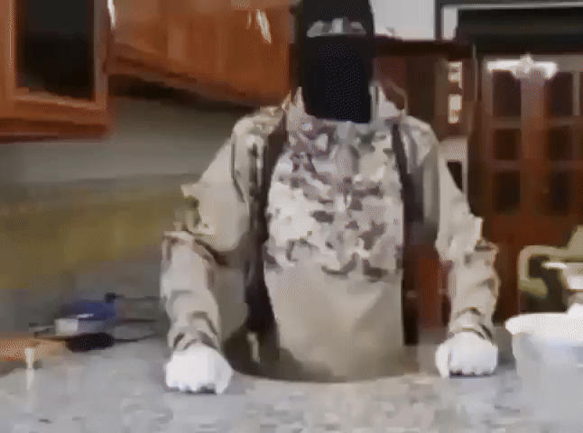

<!-- markdownlint-disable first-line-h1 -->
<!-- markdownlint-capture -->
<!-- markdownlint-disable no-inline-html -->
<div align="center">

  

  <!-- markdownlint-disable-next-line heading-start-left -->
  # Redmi 10C debloated MIUI

  [][sponsor_link]

  > 🩹 Patches for creating a clean MIUI by yourself

</div>
<!-- markdownlint-restore -->

## ✨ Features

- Removed `cust.img` which reduces firmware size by 1.2+ GB and speeds up installation speed by a couple of minutes
- Removed unnecessary preinstalled APKs and removed default audio recording permissions for some apps
- Clean factory firmware that you can edit and control

## 🛠️ Getting started

> [!WARNING]
> **Disclaimer**: These patches are under development and have not yet been sufficiently tested, all risks associated with modifying system files are your own responsibility.

### Prerequisites

- **OS**: **Linux** (or [**WSL**](https://learn.microsoft.com/windows/wsl/about)) for modifying files and applying patches, the following instructions are written only for Linux, for flashing firmware you can also use Windows
- [git](https://git-scm.com/downloads)
- [uv] to run Python
- 💿 Redmi 10C ROM (fastboot), I recommend using the **European** version of MIUI - <https://xmfirmwareupdater.com/miui/fog/stable/V14.0.10.0.TGEEUXM>

  These instructions use the `fog_eea_global_images_V14.0.10.0.TGEEUXM_20250224.0000.00_13.0_eea_f07e576e57.tgz` image, you can use a different image, but then the patches may not apply

## 📦 Unpacking the Archive

1. Copy the ROM archive to a convenient directory.
2. Verify the archive checksum to verify its integrity:

   ```bash
   md5sum fog_eea_global_images_V14.0.10.0.TGEEUXM_20250224.0000.00_13.0_eea_f07e576e57.tgz
   ```

   The result should match this checksum:

   ```plaintext
   f07e576e5745f36310a2463038662b59
   ```

   If you use a different image, the checksum must match the one listed on the website from which you downloaded it.

3. Extract the archive:

   ```bash
   tar -xf fog_eea_global_images_V14.0.10.0.TGEEUXM_20250224.0000.00_13.0_eea_f07e576e57.tgz
   ```

## 🩹 Applying the Patches

1. Copy the patch folder from this repository to the folder with the extracted ROM
2. Apply all basic patches:

   ```bash
   ./patches/01-basic/apply.sh
   ```

   To find out what these patches do, you can read the patch files, they describe in human language what has been changed.

### 🥼 Advanced patches

#### **`images/userdata.img`**

First, you need to unpack this file

To do this, you will need to install the `simg2img` tool:

```bash
sudo apt install android-sdk-libsparse-utils -y
```

Then run the command:

```bash
simg2img images/userdata.img images/userdata.raw.img
```

Then we need to mount the `images/userdata.raw.img` file:

```bash
mkdir images/userdata
sudo mount -t f2fs -o loop,rw images/userdata.raw.img images/userdata
```

Now we can apply the patches to the `images/userdata` folder:

```bash
./patches/02-userdata.img/apply.sh
```

Now we need to package the image back:

```bash
sudo umount images/userdata
rm images/userdata.img
img2simg images/userdata.raw.img images/userdata.img
rm images/userdata.raw.img
rm -rf images/userdata
```

Great! `images/userdata.img` is now patched

---

#### **`images/super.img`**

To work on this partition we need to download `lpunpack` to unpack `super.img` and `lpmake` to pack it:

```bash
wget https://raw.githubusercontent.com/Exynos-nibba/lpunpack-lpmake-mirror/d0f9da322b764871e54072d1b3e9d67c09cd715c/binary/{lpunpack,lpmake}
chmod +x ./{lpunpack,lpmake}
```

Then we need to unpack all the partitions from `super.img` into the `images/super` folder:

```bash
simg2img images/super.img images/super.unsparse.img
mkdir images/super
./lpunpack images/super.unsparse.img images/super
```

##### **`mi_ext_a.img`**

Allocate a little more space to work on the image:

```bash
fallocate images/super/mi_ext_a.img -l 50M
e2fsck -yf images/super/mi_ext_a.img
resize2fs images/super/mi_ext_a.img 50M
```

> [!WARNING]
> Don't use `truncate` command for allocating free space, it will break the image and you won't be able to work on it. Use only `fallocate` and `resize2fs` command.

<!-- markdownlint-disable-next-line no-inline-html -->
> <sup>If you know a more adequate mounting option without the need to increase the image size, dance with a tambourine and `e2fsck`, then please [create an issue](https://github.com/okineadev/Redmi-10C-MIUI-patches/issues/new) or PR here with updated instructions</sup>

<!-- markdownlint-disable-next-line no-inline-html -->


We need to disable the `shared_blocks` option, otherwise we won't be able to mount the image (see [https://blog.senyuuri.info/posts/2022-04-27-patching-android-super-images](https://blog.senyuuri.info/posts/2022-04-27-patching-android-super-images/#:~:text=It%20turned%20out%20that%20system%20imgage%20in%20Android%2010%2B%20is%20formated%20with%20EXT4_FEATURE_RO_COMPAT_SHARED_BLOCKS%2C%20found%20by%20%40topjohnwu) and <https://x.com/topjohnwu/status/1170404631865778177>)

```bash
e2fsck -yE unshare_blocks images/super/mi_ext_a.img
```

Now we can mount the image:

```bash
mkdir images/super/mi_ext_a
sudo mount -t ext4 -o loop,rw images/super/mi_ext_a.img images/super/mi_ext_a
```

> [!IMPORTANT]
> When editing any files, you **must** use `sudo` and it is preferable to do all operations only in the terminal, otherwise you have a chance to break the image.

<!-- markdownlint-disable-next-line no-inline-html -->
> <sup>If you know a more adequate mounting option with the ability to edit files without `sudo`, [please create an issue](https://github.com/okineadev/Redmi-10C-MIUI-patches/issues/new) or PR here with updated instructions.</sup>

Apply patches:

```bash
./patches/03-super.img/01-mi_ext_a.img/apply.sh
```

After applying the patches, we need to unmount the image and shrink it to its actual size:

```bash
sudo umount images/super/mi_ext_a
rm -rf images/super/mi_ext_a
e2fsck -yf images/super/mi_ext_a.img
resize2fs -M images/super/mi_ext_a.img
e2fsck -yf images/super/mi_ext_a.img
resize2fs -M images/super/mi_ext_a.img
resize2fs -M images/super/mi_ext_a.img
```

> [!NOTE]
> You **really need** to run `resize2fs -M` **two** or more times, because it doesn't compress the image to the minimum the first time, you need to do it until `resize2fs` says "**Nothing to do!**"

##### **`product_a.img`**

<!-- markdownlint-disable-next-line no-inline-html -->


Allocate a little more space in the image, the file itself is **4.5+ GB**, and we need to increase its size to **5 GB**):

```bash
fallocate images/super/product_a.img -l 5G
e2fsck -yf images/super/product_a.img
resize2fs images/super/product_a.img 5G
```

<!-- markdownlint-disable-next-line no-inline-html -->
> <sup>If you know a more adequate mounting option without the need to increase the image size, dance with a tambourine and `e2fsck`, then please [create an issue](https://github.com/okineadev/Redmi-10C-MIUI-patches/issues/new) or PR here with updated instructions</sup>

As in the previous section, disable the `shared_blocks` option:

```bash
e2fsck -yE unshare_blocks images/super/product_a.img
```

Now we can mount the image:

```bash
mkdir images/super/product_a
sudo mount -t ext4 -o loop,rw images/super/product_a.img images/super/product_a
```

Next we can apply the patches, note that we need `sudo` access here.

```bash
./patches/03-super.img/02-product_a.img/apply.sh
```

Then unmount the image:

```bash
sudo umount images/super/product_a
e2fsck -yf images/super/product_a.img
resize2fs -M images/super/product_a.img
e2fsck -yf images/super/product_a.img
resize2fs -M images/super/product_a.img
resize2fs -M images/super/product_a.img
rm -rf images/super/product_a
```

## 📦 `super.img` packing

After all these modifications to the `super.img` sections, we need to repackage them

To do this we need to use `lpmake`, here is the command to package our partitions into a new `super.new.img`:

```bash
./lpmake \
   --metadata-size 65536 \
   --metadata-slots 3 \
   --super-name super \
   \
   --device super:9126805504 \
   \
   --group qti_dynamic_partitions_a:8589934592 \
   --group qti_dynamic_partitions_b:8589934592 \
   \
   --partition product_a:none:<partition_size>:qti_dynamic_partitions_a    --image product_a=./images/super/product_a.img       --partition product_b:none:0:qti_dynamic_partitions_b \
   --partition system_a:none:<partition_size>:qti_dynamic_partitions_a     --image system_a=./images/super/system_a.img         --partition system_b:none:0:qti_dynamic_partitions_b \
   --partition system_ext_a:none:<partition_size>:qti_dynamic_partitions_a --image system_ext_a=./images/super/system_ext_a.img --partition system_ext_b:none:0:qti_dynamic_partitions_b \
   --partition vendor_a:none:<partition_size>:qti_dynamic_partitions_a     --image vendor_a=./images/super/vendor_a.img         --partition vendor_b:none:0:qti_dynamic_partitions_b \
   --partition mi_ext_a:none:<partition_size>:qti_dynamic_partitions_a     --image mi_ext_a=./images/super/mi_ext_a.img         --partition mi_ext_b:none:0:qti_dynamic_partitions_b \
   \
   --sparse \
   --virtual-ab \
   --output images/super.img
```

We need to fill in some data here, to do this we first need to get data about the current working partitions on the device with `adb shell lpdump`:

```bash
adb shell lpdump
```

<!-- markdownlint-capture -->
<!-- markdownlint-disable no-inline-html -->
<details>
<summary><b>Output</b></summary>

```plaintext
Slot 0:
Metadata version: 10.2
Metadata size: 1104 bytes
Metadata max size: 65536 bytes
Metadata slot count: 3
Header flags: virtual_ab_device
Partition table:
------------------------
  Name: product_a
  Group: qti_dynamic_partitions_a
  Attributes: none
  Extents:
    0 .. 6661167 linear super 2048
------------------------
  Name: product_b
  Group: qti_dynamic_partitions_b
  Attributes: none
  Extents:
------------------------
  Name: system_a
  Group: qti_dynamic_partitions_a
  Attributes: none
  Extents:
    0 .. 2760231 linear super 6664192
------------------------
  Name: system_b
  Group: qti_dynamic_partitions_b
  Attributes: none
  Extents:
------------------------
  Name: system_ext_a
  Group: qti_dynamic_partitions_a
  Attributes: none
  Extents:
    0 .. 1599671 linear super 9424896
------------------------
  Name: system_ext_b
  Group: qti_dynamic_partitions_b
  Attributes: none
  Extents:
------------------------
  Name: vendor_a
  Group: qti_dynamic_partitions_a
  Attributes: none
  Extents:
    0 .. 1885663 linear super 11026432
------------------------
  Name: vendor_b
  Group: qti_dynamic_partitions_b
  Attributes: none
  Extents:
------------------------
  Name: mi_ext_a
  Group: qti_dynamic_partitions_a
  Attributes: none
  Extents:
    0 .. 4559 linear super 12912640
------------------------
  Name: mi_ext_b
  Group: qti_dynamic_partitions_b
  Attributes: none
  Extents:
------------------------
Super partition layout:
------------------------
super: 2048 .. 6663216: product_a (6661168 sectors)
super: 6664192 .. 9424424: system_a (2760232 sectors)
super: 9424896 .. 11024568: system_ext_a (1599672 sectors)
super: 11026432 .. 12912096: vendor_a (1885664 sectors)
super: 12912640 .. 12917200: mi_ext_a (4560 sectors)
------------------------
Block device table:
------------------------
  Partition name: super
  First sector: 2048
  Size: 9126805504 bytes
  Flags: none
------------------------
Group table:
------------------------
  Name: default
  Maximum size: 0 bytes
  Flags: none
------------------------
  Name: qti_dynamic_partitions_a
  Maximum size: 8589934592 bytes
  Flags: none
------------------------
  Name: qti_dynamic_partitions_b
  Maximum size: 8589934592 bytes
  Flags: none
------------------------
```

</details>
<!-- markdownlint-restore -->

Let's analyze the `lpdump` parameters

- **`--metadata-size 65536`**: The maximum metadata size, `65536` will be enough, in the `lpdump` dump from our phone it was exactly what it said - `Metadata max size: 65536 bytes`
- **`--metadata-slots 3`**: Number of slots, `2` for **A/B** devices and `1` for **non-A/B**, in our phone model `3` (possibly due to **virtual-A/B**?)
- **`--device super:9126805504`**: The size of the entire `super` partition, it should be taken **only** from the `lpdump` dump, you can find this size in the `Block device table` section
- **`--group qti_dynamic_partitions_[ab]:8589934592`**: Partition groups, their names and sizes should be taken from the `Group table` section of the `lpdump` dump, and yes, even the `qti_dynamic_partitions_b` group should have the same size as `qti_dynamic_partitions_a`, even if the first one has 0 bytes
- **`--virtual-ab`**: In order for the metadata of the `super.img` image to match the original, we need to enable this checkbox, because this phone has **virtual-A/B** partitions

Now we need to replace all `<partition_size>` with the partition sizes in bytes

To do this, you can use this simple command which will output readable data about the partitions:

```bash
stat -c '%n %s' images/super/*_a.img | awk '{size=$2; cmd = "echo " size " | numfmt --to=si"; cmd | getline human_size; close(cmd); divisible = (size % 512 == 0) ? "Yes" : "No"; printf "%s %s %s %s\n", $1, human_size, size, divisible;}' | column -t --table-columns Partition,Size,"Size in Bytes","Divisible by 512"
```

The output will be something like this:

```plaintext
Partition                      Size  Size in Bytes  Divisible by 512
images/super/mi_ext_a.img      2.4M  2334720        Yes
images/super/product_a.img     3.5G  3410518016     Yes
images/super/system_a.img      1.5G  1413238784     Yes
images/super/system_ext_a.img  820M  819032064      Yes
images/super/vendor_a.img      966M  965459968      Yes
```

Replace all `<partition_size>` in the `lpmake` command with your sizes from the `Size in Bytes` column, after what you can run the `lpmake` command

> [!WARNING]
> All sizes **MUST** be divisible by `512`, if not - then something is wrong with the image, try fixing it with `e2fsck -yf` and shrinking it again with `resize2fs -M`

## ⚡ Flashing the firmware

<!-- markdownlint-disable-next-line no-inline-html -->


### Requirements

1. Unlocked bootloader
2. `fastboot` installed

   If not installed, you can install it using the followiяng command:

   ```bash
   sudo apt install android-sdk-platform-tools -y
   ```

3. USB cable (preferable the factory cable) which can transmit data (sometimes there are cables that only transmit power without data)

<!-- markdownlint-disable-next-line no-inline-html -->


> [!CAUTION]
> If the cable is broken, or has any problems with data transfer or power - stop immediately and find another working cable, otherwise you will have a chance to [brick](https://android.fandom.com/wiki/Bricked_Phone) your phone.

### Preparation

Before flashing, you need to update the file checksums:

```bash
uv run flash_gen_crc_list.py
```

It will update the files `images/crclist.txt` and `images/sparsecrclist.txt`

### Flashing

Make sure you haven't missed anything.

> [!IMPORTANT]
> Back up all your data and photos from your phone, as it will completely erase the data from your phone.

<!-- markdownlint-disable-next-line no-inline-html -->
1. Boot into fastboot mode by holding the <kbd>Power</kbd> + <kbd>Volume Down</kbd> buttons until the phone vibrates and the **fastboot** screen appears.
2. Connect the phone to your computer using a USB cable.
3. Open a terminal and navigate to the folder with the firmware.
4. Run the following command to flash the firmware:

   ```bash
   ./flash_all.sh --disable-verity --disable-verification
   ```

   Meanwhile, you can have tea while it flashes the firmware 🍵😌

> [!NOTE]
> Here `--disable-verity --disable-verification` was added to disable the firmware integrity check at the `vbmeta` flashing step, otherwise when you boot the phone it will automatically throw you back into `fastboot` mode
>
> Of course we can make new signatures for system images, but this is the easiest way

---

## 📝 Conclusions

Please, never buy phones and other devices with internet access from Xiaomi, I think everything else is fine, their phones are good for their price, but as it says - _free cheese is only in a mousetrap_, instead they are stuffed with a lot of bloatware, eavesdropping, advertising in system applications, which looks like a crappy application from the Play Market

Here you pay with your nerves.

Even if you want to solve this yourself (like here), you will still need to give your real number to Xiaomi (read <https://gist.github.com/probonopd/926e485224f3e7394d7e569653522766#file-xiaomi_redmi_10c-md>).

If I had known about this earlier - I would never have bought this phone.

Better consider Samsung or Google Pixel

## 📰 Useful articles that have made a significant contribution to this project

- <https://blog.senyuuri.info/posts/2022-04-27-patching-android-super-images>
- <https://xdaforums.com/t/editing-system-img-inside-super-img-and-flashing-our-modifications.4196625>
- <https://xdaforums.com/t/redmi-10c-after-modifying-and-flashing-super-img-the-phone-gets-stuck-in-bootloop.4736034>

## ❤️ Support

If you like this project, consider supporting it by starring ⭐ it on GitHub, sharing it with your friends, or [buying me a coffee ☕][sponsor_link]

[](https://github.com/sponsors/okineadev)

## 📜 License

[MIT License](./LICENSE) © 2025-present [Yurii Bogdan](https://github.com/okineadev)

[uv]: https://github.com/astral-sh/uv#installation
[sponsor_link]: https://github.com/sponsors/okineadev
